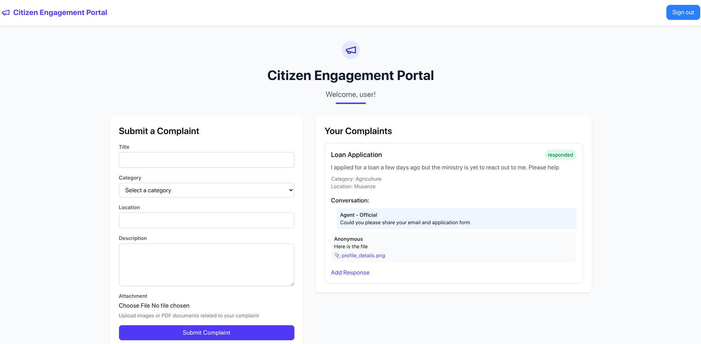
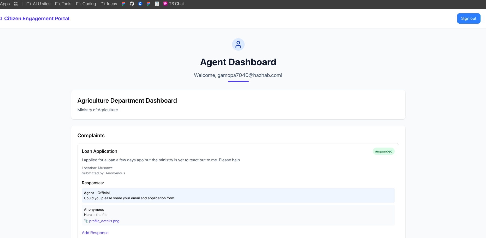
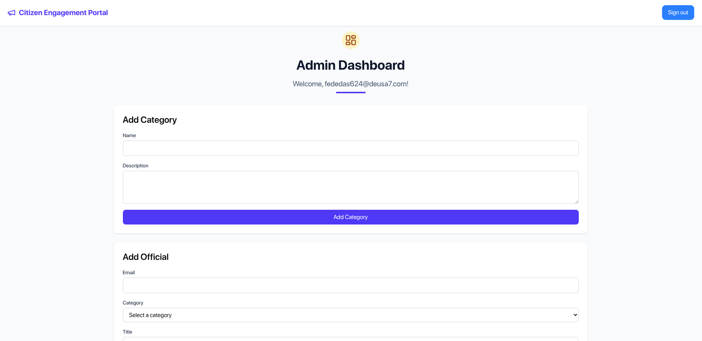

# Citizen Engagement Portal

A full-stack web application for managing citizen complaints and official responses, built with React, Convex, and TailwindCSS.

## Deployment

The application is deployed using vercel and can be accessed at [Citizen Engagement Portal](https://citizen-engagement-platform.vercel.app/)

## Live Demo Video

[Watch the live demo video here](https://drive.google.com/file/d/1QdZK_89Ustntt5D7H4p2adz2qIxp-cwr/view?usp=sharing)

## Features

### For Citizens

- Submit complaints with detailed information
- Attach supporting documents (images/PDFs)
- Track complaint status
- View official responses
- Engage in conversation with officials
- View complaint history



### For Officials

- Department-specific dashboard
- View and respond to complaints in their category
- Attach documents to responses
- Update complaint status automatically
- Track conversation history



### For Administrators

- Manage department categories
- Add and manage department officials
- View all categories and officials
- System configuration



## Technical Stack

- **Frontend**: React + Vite
- **Backend**: Convex (Backend as a Service)
- **Styling**: TailwindCSS
- **Authentication**: Convex Auth
- **File Storage**: Convex Storage
- **Notifications**: Sonner Toast

## Data Model

### Categories

- name: string
- description: string
- agencyEmail: optional string

### Complaints

- title: string
- description: string
- categoryId: reference to categories
- status: string ("pending" | "responded")
- submitterId: reference to users
- location: string
- attachmentId: optional reference to storage
- attachmentName: optional string

### Responses

- complaintId: reference to complaints
- responderName: string
- message: string
- isOfficial: boolean
- attachmentId: optional reference to storage
- attachmentName: optional string

### Officials

- userId: reference to users
- categoryId: reference to categories
- title: string

### Admins

- userId: reference to users

## Getting Started

1. Clone the repository
2. Install dependencies:

   ```bash
   bun install
   ```

3. Start the development server:

   ```bash
   bun run dev
   ```

## Authentication

The system uses Convex Auth with username/password authentication. Users can:

- Register with email
- Sign in with email/password
- Sign out

## File Handling

The application supports:

- Image uploads (any image format)
- PDF document uploads
- Secure file storage
- Automatic URL generation for downloads

## User Roles

### Citizens (Default Users)

- Can submit complaints
- Can view their complaints
- Can respond to official responses

### Department Officials

- Access department-specific dashboard
- View complaints in their category
- Respond to complaints
- Mark complaints as responded

### Administrators

- Full system management
- Category creation
- Official assignment
- System monitoring

## Security Features

- Authentication required for all actions
- Role-based access control
- Secure file storage
- Input validation
- XSS protection

## UI Components

- Responsive design
- Toast notifications
- Loading states
- Error handling
- File upload preview
- Status indicators

## Development Guidelines

### Adding New Features

1. Update the schema if needed
2. Add new Convex functions
3. Create/update React components
4. Test thoroughly
5. Deploy changes

### Code Organization

- `/convex`: Backend functions and schema
- `/src`: Frontend React components
- `/src/lib`: Utility functions
- `/public`: Static assets

## Best Practices

- Use TypeScript for type safety
- Follow React hooks guidelines
- Implement proper error handling
- Add loading states
- Use proper validation
- Follow security best practices

## Contributing

1. Fork the repository
2. Create a feature branch
3. Make your changes
4. Submit a pull request
